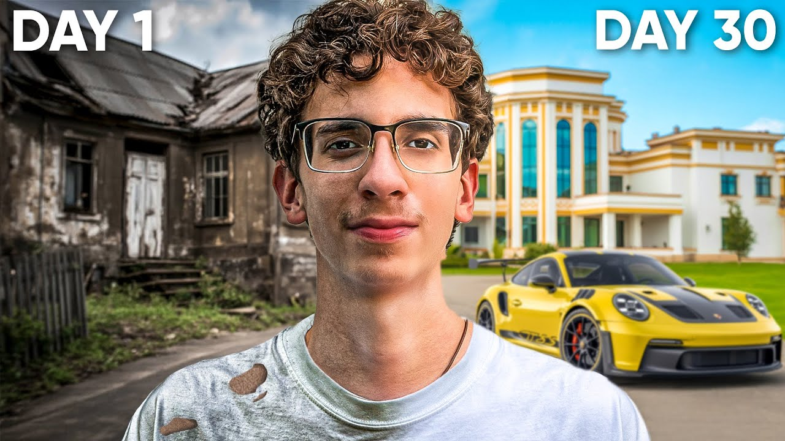
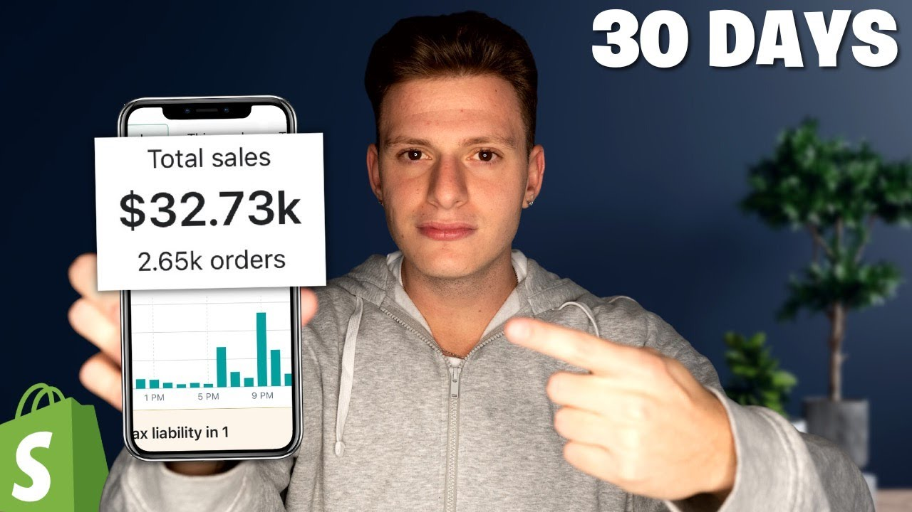
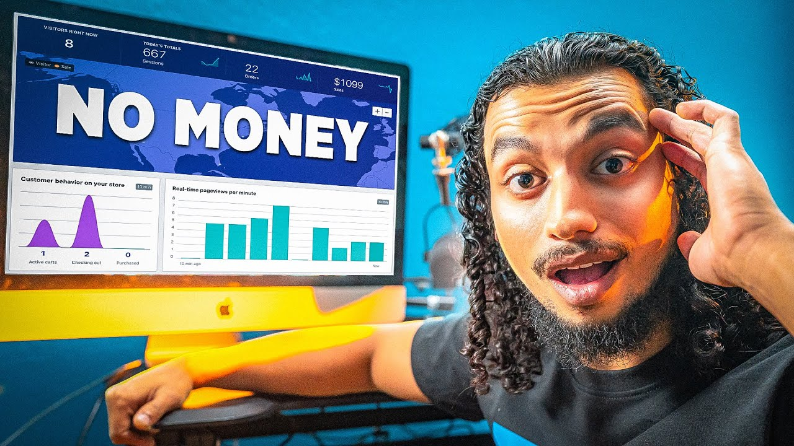
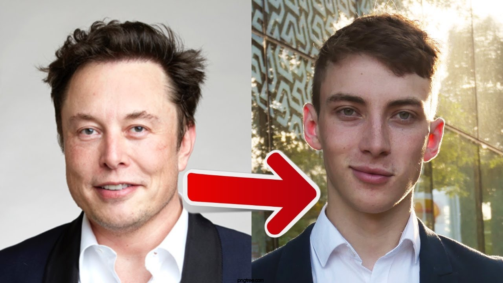
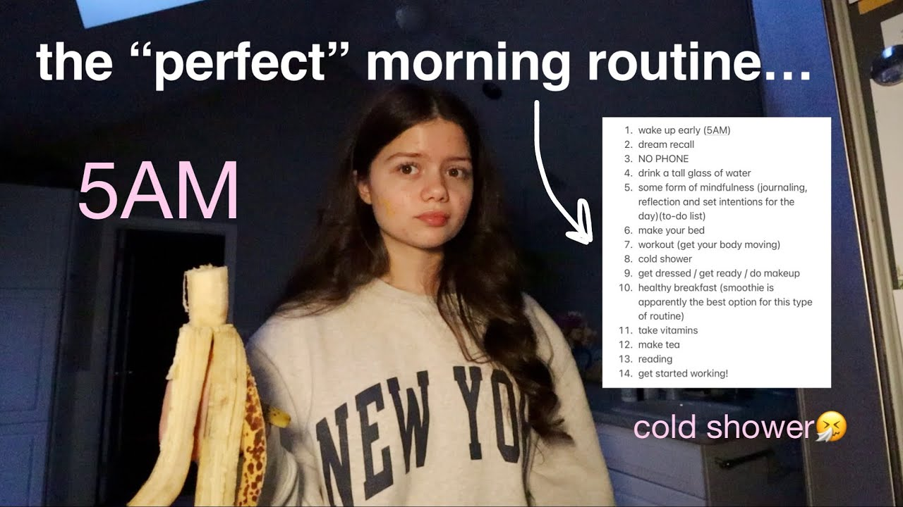

# Vault EP1 — Title & Thumbnail REFERENCE LIST (proven sources only)

**Purpose:** ground every title + thumbnail decision for the Bezos "Vault" episode in **verified, proven data** — not intuition. Built 2026-06-27. Every pattern below is tagged with its source and the real evidence behind it. Read this BEFORE picking titles.

---

## 0. Sources & honesty ledger (what's actually proven)

| Source | What it gives us | Confidence |
|---|---|---|
| **`references/thumbnail-patterns-2026-05-18.md`** → 1of10/Quasa **323,000-video CTR study** (62.6B views) | Hard thumbnail CTR numbers | ✅ **High** — real study, hard numbers |
| **Sandcastles** (Gray's paid tool) — `top_hooks` watchlist + `search_all_videos` "billionaire tactic" | Proven outlier hooks/formats w/ real view counts + outlier scores | ✅ **High** — real engagement data |
| **Playbook hook refs** (Kallaway 710K-view masterclass; Ava "I studied 7,356 hooks") | Hook/title psychology + the "challenge" angle | ✅ **High** — vetted internal |
| **Live niche research** (15-25 real video titles in the "I tried [billionaire] tactic" lane) | Real title formulas + keyword frequency | 🟡 **Medium** — titles/channels verified; **view counts NOT verified** |

### ⚠️ The honest gaps
1. ✅ **RESOLVED — view counts now verified** via the YouTube Data API (2026-06-27). See §2.5 for the real ranked numbers. They **overturned** the title-frequency read (see below).
2. **No verified thumbnail images** inspected per-example (thumbnail URLs were captured via the API and can be pulled on request); conventions below are from the CTR study + Sandcastles thumbnails we CAN see.
3. **No keyword search-volume tool** (no VidIQ/TubeBuddy/Ahrefs). Everything called a "keyword" is **proven-by-recurrence + now cross-checked against real views**, NOT a search-volume number.
4. **"Jeff Bezos" is RARE in real video titles** — and the real view data shows named-celebrity-routine videos mostly UNDERPERFORM. Strategic implication in §5.

---

## 1. Hard thumbnail facts (from the 323K-video CTR study)

Load-bearing, non-negotiable:
- **Faces lift CTR +36% in business/finance** specifically. Faces matter MORE in Sai's niche than anywhere.
- **Multiple faces beat single faces** (social proof). → Sai + Bezos dual-face is backed.
- **Text costs ~19% of views ON AVERAGE — UNLESS it's under 10 characters AND under 7% of the image.** That exception is the whole game: one short word or number only.
- **Winning colors vs YouTube's UI: cyan, green, yellow, orange.** Orange = Sai's brand `#F28129` → built-in tailwind.
- **Optimal brightness 100–110/255.** Not dark, not blown out.
- **2026 trend:** clean composition + bold contrast + negative space is winning; cluttered shock-face + heavy text is fatiguing. **Big number on minimal background = the new dominant.**

---

## 2. Proven TITLE formulas (each backed by ≥2 real titles)

From live niche research (real verified titles):

| # | Formula | Real evidence (verbatim titles) | Source |
|---|---|---|---|
| T1 | **"I Tried [Person]'s [routine/habit/tactic] for [timeframe]"** ← the dominant formula | *I tried Elon Musk's (insane) routine for 7 Days* · *I Tried Elon Musk's Morning Routine For 7 Days* | research |
| T2 | **"I Tried a Billionaire's [X]"** (generic "billionaire," unnamed — the routine is the draw) | *I Tried a Billionaire's Morning Routine \| Here's What Happened* · *I Tried The 5AM "Billionaire Morning Routine"* | research |
| T3 | **Transformation arc — "From Broke to Rich in 30 Days" / "From X to Y"** | *I Took A Stranger From Broke To Rich In 30 Days* (Jordan Welch) · Sandcastles: *From 17K/month to 16 Lakh per month* (17.4M views, 142x outlier) | research + Sandcastles |
| T4 | **Constraint hook — "with $0 / With NO MONEY"** | *I Tried Launching an AI Business with $0* · *I Tried Dropshipping With $0 For 30 days* | research |
| T5 | **"The [X] BILLIONAIRE 🤯 … how he got RICH"** (caps + emoji + curiosity) | Sandcastles: School of Hard Knocks — *The Ferrari BILLIONAIRE* (35.7M, 7.9x) · *The tobacco BILLIONAIRE* (18.9M) · *The $11 BILLION MAN* (Bill Ackman, 9.9M) | Sandcastles |
| T6 | **"I built [X]" personal-experience / build-in-public** | Sandcastles top hooks: *risewithmohit* (17.4M, 142x), *jayhoovy* build-in-public | Sandcastles |

**Recurring title decorators (proven by recurrence):**
- Parenthetical intensifier: **"(insane)"**, **"(why do they do this?)"**
- Outcome tail: **"| Here's What Happened"**
- All-caps superlative: **"WORLD'S Most"**, **"BILLIONAIRE"**, **"RICH"**
- 🤯 emoji (money-niche short-form; use cautiously on long-form YT)

---

## 2.5 REAL view data (YouTube Data API, 2026-06-27) — this OVERTURNED the title-frequency read

Ranked actual views for the 19 researched titles:

| Views | Likes | Video | Channel | Pattern |
|---|---|---|---|---|
| **2,561,208** | 100K | I Went From Broke To Rich In 30 Days | Jordan Welch | transformation + 30 days |
| **1,394,467** | 62K | I Tried Dropshipping With $0 For 30 days | Tan Choudhury | constraint + 30 days |
| **1,372,160** | 45K | I Took A Stranger From Broke To Rich In 30 Days | Jordan Welch | transformation + 30 days |
| 512,421 | 14K | i tried the BILLIONARE morning routine | Erika Diane | generic billionaire |
| 406,623 | 15K | I Tried The WORLD'S Most PRODUCTIVE Day | Nicolas Berndt | superlative |
| 365,577 | 14K | WORLDS Most Productive Routine For 30 Days | Nicolas Berndt | superlative + 30 days |
| 256,384 | 10K | How I Made $32,000 in 30 Days Dropshipping | Cam Vito | $ result + 30 days |
| 187,517 | 5.5K | I Took A Trader From Broke To Rich In 30 Days | TJR | transformation + 30 days |
| 105,042 | 2.6K | I Tried Elon Musk's Morning Routine For 7 Days | Andrew Kirby | named celebrity |
| 63,153 | 2.6K | I Tried The 5AM "Billionaire Morning Routine" | The Financial Diet | generic billionaire |
| 61,166 | 2.3K | morning routines of the most successful CEOs | Ciarán Carlin | generic CEO |
| 34,214 | 1.6K | I Tried Jordan Welch's $197 Dropshipping Course | CeboEcom | named-creator reaction |
| 15,726 | 729 | I Tried Launching an AI Business with $0 | AI Founders | constraint |
| 9,860 | 617 | I Tried Rich People's Scientific Daily Routine | Kevin Harris | generic rich |
| 7,890 | 0 | I Tried Elon Musk's Routine for 24 Hours as CS student | ramya | named celebrity |
| 7,121 | 302 | Shopify Dropshipping for 1 Month With NO MONEY | Matt While | constraint |
| 3,652 | 214 | I Tried A Billionaire's Morning Routine! | Emiley Baker | generic (tiny ch.) |
| 1,071 | 74 | I tried Elon Musk's (insane) routine for 7 Days | Jakob Manthei | named celebrity |
| 63 | 4 | I Tried a Billionaire's Morning Routine \| Here's What Happened | Tyler Dreger | generic (tiny ch.) |

**What the REAL numbers say (vs. what title-frequency implied):**
1. ❌ **"I tried [named celebrity]'s routine" is a TRAP** — every Elon Musk attempt landed 1K–105K. Crowded, weak. Title-frequency made it look dominant; views prove it isn't.
2. ✅ **The real outliers (1.3M–2.5M) are ALL the "Broke to Rich in 30 Days" transformation DOCUMENTARIES** (Jordan Welch). That structure = a real person + real business + a 30-day clock + documentary = **exactly Sai's Vault structure.** Jordan Welch is the #1 comp.
3. ✅ **"30 Days" appears in 6 of the top 8.** The load-bearing keyword is the timeframe, not the billionaire.
4. ✅ **Constraint/result framing wins** ("$0", "$32,000 in 30 Days") — concrete stakes + number.
5. ⚠️ Channel size matters: the 63-view and 3,652-view billionaire-routine videos are tiny channels — the format doesn't save a small channel, but Sai's *structure* (real business, real stakes) is the Jordan-Welch lane, not the routine-trope lane.

**Refined strategy:** title the episode like a **transformation documentary with a 30-day clock and a real outcome**, with the billionaire as flavor — NOT like a "I copied a celebrity's routine" video.

---

## 3. Proven KEYWORDS (by recurrence — NOT search volume)

Across ~19 real titles in the exact lane, building blocks ranked by frequency:

| Phrase | Appears in | Note |
|---|---|---|
| **"I Tried"** | ~13 / 19 | Single strongest opener in the niche |
| **"30 Days" / "for 30 Days"** | ~7 | **Beats "a week"** — stronger commitment signal |
| **"Morning Routine" / "routine"** | ~9 | Most common topic noun (Bezos tactic isn't a routine — adapt) |
| **"Billionaire" / "Billionaire's"** | ~5 + huge in Sandcastles | Generic "billionaire" proven on its own |
| **"Elon Musk"** | ~3 | **The most-named individual. Bezos barely appears.** |
| **"Broke to Rich"** | 3 | The transformation-arc phrase |
| **"$0 / NO MONEY / $[number]"** | ~5 | Money constraint or result |

---

## 4. Proven THUMBNAIL patterns for THIS lane

From the CTR study + the 7-pattern library + what we can see in Sandcastles thumbnails:

- **Dual-face** (Sai | Bezos) — backed by "multiple faces beat single" + the billionaire-interview lane's face-forward convention.
- **One anchor number, ≤10 chars** — "2 HRS", "30 DAYS", "5 PEOPLE". Dodges the −19% text penalty. (Pattern: `big-dollar-number` / `single-anchor-word`.)
- **Orange `#F28129` as the accent / arrow** — Sai's brand IS one of the 4 winning colors; use it the way Brett/Jordan use red.
- **Expression:** the **"I tried" lane uses an exhausted/shocked creator face**; the **mentor lane uses calm-authority**. For this episode, Sai's genuine *"of course it landed on the hard one"* reaction is the honest middle.
- **Prop cue for "what I'm copying":** Bezos's face OR an Amazon/clock/"$100B" cue.
- **Clean + bright (100–110), negative space** — 2026 trend; avoid clutter.

---

## 4.5 REAL thumbnails — downloaded + analyzed (YouTube Data API, 2026-06-27)

The actual thumbnails of the top performers (saved in `reference-thumbnails/`). This is evidence-grade — I looked at each one.

### The #1 winner template: TRANSFORMATION SPLIT + "DAY 1 | DAY 30"

**Jordan Welch — 2.6M views.** Face centered, calm-confident (NOT shock), torn black tee. **Left = decrepit house (desaturated, "before"); right = mansion + gold Lamborghini (saturated, "after").** Almost zero text — the visual transformation IS the thumbnail.

**Jordan Welch — 1.4M views.** Same template, with the clock made explicit: **"DAY 1"** top-left | **"DAY 30"** top-right (white, bold, ~6 chars each). Decrepit house → mansion + Porsche. This is the cleanest expression of the winning formula.

### The #2 template: RECEIPTS (dashboard/phone) + specific number + "30 DAYS"

**Cam Vito — 256K.** Points at a phone showing **"$32.73k / 2.65k orders"** (real receipts). **"30 DAYS"** top-right. Shopify logo. Clean dark studio.

**Tan Choudhury — 1.4M.** Dashboard screenshot + face (hand-to-temple) + just **"NO MONEY"** (8 chars). Receipts + one short text.

### The "I tried [celebrity]" template (works, but caps LOWER — the trap)

**Andrew Kirby — 105K.** Literal dual-face: **Elon Musk (left) → creator (right), big red arrow between.** Clean, but this celebrity-copy template tops out ~100K. ⚠️ **This maps to Sai's concept (Bezos → Sai) — but the data says do it BIGGER than just a routine-copy.**

### Lifestyle/list aesthetic (off-brand for Sai)

**Erika Diane — 512K.** Cluttered, relatable-girl lo-fi: the routine as a 14-item **list**, handwritten arrow, "5AM," "cold shower." Works in lifestyle; **wrong look for Sai's premium business brand.**

> Other downloaded refs (05 Nicolas Berndt 406K, 06 365K, 08 TJR 187K, 10 Financial Diet 63K, 11 Ciarán Carlin 61K, 12 CeboEcom 34K) are in the folder.

### What the REAL thumbnails prove (and what to steal for Sai)
1. **The 1M+ winners are transformation-split, not celebrity-copy.** Before (desaturated, left) → after (saturated, right), face centered, **minimal text**, the **30-day clock in the corners ("DAY 1 / DAY 30")**.
2. **Receipts win** — a phone/dashboard showing a real number + point-at-it gesture.
3. **Text is tiny** — "DAY 1", "DAY 30", "NO MONEY", "30 DAYS" — every winner obeys the ≤10-char rule. The losers (Erika) are text-heavy.
4. **Calm-confident face** > shock-face in the 1M+ tier (Jordan Welch); shock works lower (Tan).

### → Refined Sai thumbnail concepts (grounded in what actually won)
- **① Transformation "DAY 1 | DAY 30"** (the 2.5M template, adapted): left = stressed/chaotic Sai or a messy team whiteboard (desaturated); right = calm Sai / shipped-changes board (saturated, orange). Corners: **"DAY 1" / "DAY 30."** Minimal text. *This is the proven #1 lane.*
- **② Bezos → Sai dual-face + arrow** (Andrew Kirby template, premium-ized): Bezos left → Sai right, vault/orange arrow between, **"30 DAYS"** or **"2 HRS/WEEK."** Dual-face = +36% CTR. Make it cinematic, not lo-fi.
- **③ Receipts** (Cam Vito template): Sai pointing at a screen showing the real outcome (changes shipped / a result number) + **"30 DAYS."** Only if the outcome produces a clean number.

---

## 5. ⚠️ The Bezos decision (data-backed, your call)

The episode is locked on Bezos. But the data says **naming Bezos in the title is NOT automatically the strongest pull:**
- **"Elon Musk" dominates** the real "I tried [founder]" titles; Bezos is rare → either an **opportunity** (uncrowded) or a sign he pulls **less** in this format.
- **Generic "a billionaire"** is independently proven huge (Sandcastles School of Hard Knocks; the generic "billionaire morning routine" videos).

**Three honest routes:**
1. **Name Bezos** — most specific/searchable, on-brand with the vault file. (e.g. *"I Ran My Company Like Jeff Bezos"*)
2. **Generic "a billionaire"** — leans on the proven generic pull + preserves the wheel-reveal mystery. (e.g. *"A Wheel Made Me Copy a Billionaire"*)
3. **Lead with the mechanic** — the wheel is **white space** in business content (proven in gaming/lifestyle, never verified in founder content) = a real differentiator, but unproven in-niche.

---

## 6. EP1 title candidates — grounded, each tagged to a proven formula

> All ≤50 chars per Gray's rule. Tag = which proven formula/source backs it.

> **Revised after the real view data:** lead with **transformation + "30 Days" + outcome** (the 1.3–2.5M Jordan-Welch lane), billionaire as flavor. "30 Days" is in 6 of the top 8 real performers.

| Title | Chars | Backed by (with REAL evidence) |
|---|---|---|
| I Ran My Company Like Bezos for 30 Days | 39 | ✅ transformation + "30 Days" (Jordan Welch 2.5M/1.37M; 30-days in 6 of top 8) + named |
| I Ran My Team Like Bezos for 30 Days | 36 | ✅ same, + the actual adaptation (customers→team) |
| 30 Days Copying a Billionaire's Playbook | 40 | ✅ "30 Days" + generic billionaire (512K beat most named-Elon) |
| I Let a Wheel Run My Company for 30 Days | 40 | ✅ "30 Days" + the wheel mechanic (white-space differentiator) |
| I Did Bezos's $100B Habit for 30 Days | 37 | ✅ "30 Days" + "$100B" number (concrete-number wins) |
| I Copied a Billionaire I Didn't Choose | 38 | 🟡 generic + wheel curiosity — no "30 Days" (curiosity play, weaker on data) |

**Avoid (data-backed):** any "I Tried [named celebrity]'s routine" framing (1K–105K real views — the trap), and "A Billionaire Ran My Company" (misleading — he copies it, doesn't hand it over).

---

## 7. EP1 thumbnail candidates — grounded, each tagged to a proven pattern

1. **Dual-face + anchor number** — Sai (left) | Bezos (right), open vault glowing between, bold orange **"2 HRS/WEEK"** (≤10 chars). → `multiple-faces` (+36%) + `single-anchor` + brand-orange.
2. **Sai mid-spin + locked face** — Sai spinning the physical wheel (motion), Bezos locked in the window, **"30 DAYS"** orange. → face + prop + anchor-number + the mechanic.
3. **Transformation tease** — Sai at the org chart, **"5 PEOPLE / 1 WEEK"** + stopwatch, wheel in frame. → `big-number` + receipts/`screenshot-as-prop` coding.
4. **Clean authority + giant number** — tight Sai face left 45%, huge orange **"$100B"** right on negative space. → 2026 clean-composition trend + brand orange + dodges text penalty.

---

## 8. Follow-up to make this evidence-grade
- Run the **YouTube Data API** (Gray's Google Cloud project) on the researched video IDs → real per-video views + thumbnail URLs. That upgrades the long-form examples from "verified titles" to "verified outliers."
- Once the Notion template is connected, port the locked A/B/C titles + thumbnails into it.
